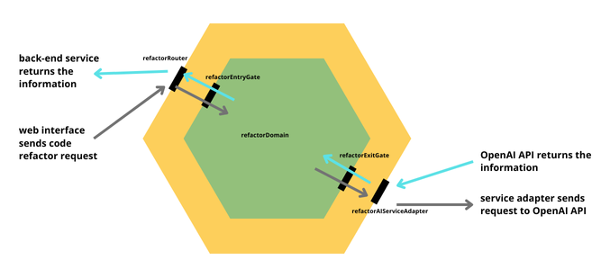

# Plank AI: Code Snippet Refactoring & Explanation Tool

Plank AI is a web-based application designed to help developers refactor and understand code snippets with the help of AI.

## How to install and run

This guide explains how to set up, run, and work with the project.

### Requirements

Make sure you have the following installed:

- **Node.js** (v18 or higher)
- **npm** (Node Package Manager)

### Project Structure

The project is divided into two main parts:

- **`web/`**: The frontend application built with Vite and React.
- **`server/`**: The backend server built with NodeJs.

### Installing Deependencies

#### Using the Shell:

Run the following commands to install dependencies for both frontend and backend:

```bash
cd web
npm install
cd ../server
npm install
```

#### Using VSCode:

1. Open the project in VSCode.
2. Press `Ctrl+Shift+P` (or `Cmd+Shift+P` on Mac) to open the Command Palette.
3. Search for **Run Task** and select `WebInstall` to install frontend dependencies.
4. Repeat and select `NodeInstall` to install backend dependencies.

### Running the Project

#### Using the Shell:

##### Start the Frontend:

```bash
cd web
npm run serve
```

By default, the frontend will be available at `http://localhost:3000`.

##### Start the Backend:

```bash
cd server
npm run serve
```

By default, the backend will be running on `http://localhost:5000`.

#### Using VSCode:

##### Running with `ProdEnvironment`:

1. Open the project in VSCode.
2. Press `F5` or go to the **Run and Debug** tab (on the left menu).
3. Select the `ProdEnvironment` configuration.

This will:

- Install dependencies for both frontend and backend.
- Start the frontend and backend servers.

### Environment Configuration

Ensure you configure the environment variables for both the frontend and backend.

#### Frontend (`web/src/config/.env`):

```
VITE_API_URL=http://localhost
VITE_API_PORT=5000
PORT=3000
```

#### Backend (`server/config/.env`):

```
PORT=5000
OPENAI_MODEL=gpt-4o-mini
OPENAI_API_KEY=<YOUR_TOKEN_HERE>
WEB_URL=http://localhost:3000
```

---

## Technologies Used

### Frontend

<a href="https://developer.mozilla.org/en-US/docs/Web/JavaScript" title="JavaScript"></a>
&nbsp;&nbsp;&nbsp;&nbsp;
<a href="https://www.typescriptlang.org/" title="Typescript"></a>
&nbsp;&nbsp;&nbsp;&nbsp;
<a href="https://reactjs.org/" title="React"></a>
&nbsp;&nbsp;&nbsp;&nbsp;
<a href="https://vite.dev/" title="Vite"></a>
&nbsp;&nbsp;&nbsp;&nbsp;
<a href="https://tailwindcss.com/" title="TailwindCSS"></a>

### Backend

<a href="https://developer.mozilla.org/en-US/docs/Web/JavaScript" title="JavaScript"></a>
&nbsp;&nbsp;&nbsp;&nbsp;
<a href="https://www.typescriptlang.org/" title="Typescript"></a>
&nbsp;&nbsp;&nbsp;&nbsp;
<a href="https://nodejs.org/" title="NodeJS"></a>
&nbsp;&nbsp;&nbsp;&nbsp;
<a href="https://expressjs.com/" title="Express"></a>
&nbsp;&nbsp;&nbsp;&nbsp;
<a href="https://expressjs.com/" title="Express"></a>
&nbsp;&nbsp;&nbsp;&nbsp;

---

## Next steps

### 1. User persona

#### Objective

Create a personalized experience by gathering key user information, which will enable the system to tailor responses and recommendations according to each user's background and expertise.

#### What to implement

##### User Information Form

Design a form where users can input relevant personal and technical details such as:

- Experience with coding, number of years/months of experience
- Preferred programming languages
- Technical focus area (Data Science, Web Development, Machine Learning)
- Other information that the user thinks could be useful

#### How it will work

- The collected user information will be utilized to create a custom **user persona**.
- This persona will serve as context for the OpenAI API prompts.
- Responses from the AI can be **tailored and relevant**, enhancing learning outcomes and comprehension for the user.

#### Example

- User Persona Information:
  - A beginner with 2 months of experience in Python, focusing on data treatment and analysis.
- Generated Prompt for OpenAI API:
  - `This user is a beginner with 2 months of experience in Python, mainly focusing on data treatment and analysis. Provide beginner-friendly recommendations and examples related to data cleaning and preprocessing.`

This ensures that OpenAI responses are aligned with the user's experience level and specific needs, resulting in more actionable and useful insights.

### 2. Interactive blackboard

Create an interactive experience by developing a blackboard where the user could use to edit the code and ask questions and possible changes to the AI model.

#### Features

- The user will can modify and experiment with code in real-time.
- It will be possible to ask questions, request explanations, suggestions or optimizations.
- Collaborate with AI, proposing changes and get AI-generated updates and insights instantly.

### 3. Beautify OpenAI results

This feature enhances the OpenAI response output by formatting the results in Markdown. It ensures that the content returned from the OpenAI API is not only easy to read but also automatically structured into React components styled with Tailwind CSS.

- Change the OpenAI API prompt to ask the response in `MarkDown` format
- Use the text is `MarkDown` format to structure the `React` components with `Tailwind CSS style`

#### How it works

- The backend calls the OpenAI API with a prompt asking for responses in Markdown format.
- OpenAI returns the response formatted in Markdown.
- The system:
  - Parses the Markdown response.
  - Automatically transforms it into structure React components.
  - Applies Tailwind CSS classes to maintain the desired visual appearence.

### 4. Extensive Front-End Testing

Implement a robust strategy to ensure the reliability and stability of the front-end codebase by covering unit tests, integration tests, and inline component tests.

#### Key Testing Tools

- Jest
  - Utilize Jest as the primary test runner for unit testing and snapshot testing.
  - Write isolated tests for individual functions and components to verify correctness.
- Reac Testing Library
  - Component-level and integration tests.
  - Focus on user interactions, rendering checks, and DOM updates.

---

## Hexagonal Architecture Concept

The concept of Hexagonal Architecture was proposed by Alistair Cockburn in the 1990s. The idea of this architecture is to build systems that promote code reusability, high cohesion, low coupling, technology independence, and are easily testable. In this context, Hexagonal Architecture divides a system's classes into two main groups:

- **Domain Classes** – directly related to the system's business logic
- **Infrastructure Classes** – related to technologies and responsible for integration with external systems

### Advantages

- Focus on Domain Logic: Developers can concentrate on the domain of the code, which represents the system's purpose and is responsible for delivering value.
- Improved Testability: Since the project's domain is decoupled from technology, it becomes easier and more practical to test.
- Technology Independence: This also facilitates swapping libraries, frameworks, and databases if necessary.



---
